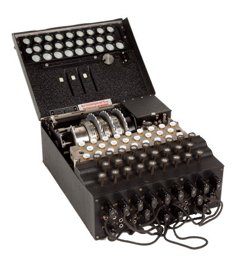

Some Python fun in the spirit of the German wartime [Enigma machine](https://en.wikipedia.org/wiki/Enigma_machine). See the bottom if you have no idea what this is.

```python
>>> from enigma import *
>>>
>>> e=Enigma() # can optionally set a three-element array of a-z
>>>            # rotor mappings and/or starting letters
>>>            # defaults are 3x `abcdefghijklmnopqrstuvwxyz`
>>>
>>> e.setTo('r','x','g')
>>>
>>> e.run('here is a test')
V       SYH
V       TZI
F       UAJ
P       VBK

I       WCL
V       XDM

K       YEN

O       ZFO
A       AGP
J       BHQ
F       CIR
>>>
>>> e.currentSetting()
'CIR'
>>>
>>> e.setTo('r','x','g') # to decrypt, use the same starting letters (and
>>>                      # implicitly here since we are using the same
>>>                      # instance, the same rotors)
>>>
>>> e.run('vvfp iv k oajf')
H       SYH
E       TZI
R       UAJ
E       VBK

I       WCL
S       XDM

A       YEN

T       ZFO
E       AGP
S       BHQ
T       CIR
```

### Notes

- Default rotor mapping is `abcdefghijklmnopqrstuvwxyz`, which just passes the same letters out as in for each rotor. A mapping of `bcdefghijklmnopqrstuvwxyza` would pass `b` for `a`, `c` for `b`, ... on up to `a` for `z`.
- The "rightmost" rotor (rotor 3) rotates one position before each letter coding, but in a true rotor, it would rotate the rotor to its left at some interval, much like an odometer, and then that rotor would rotate the one to its left.
- There is no plug board (_Steckerbrett_). Sue me.

### Uh, what?

The bare minimum you need to know to understand what the Enigma machine did: 

- The machine had three rotors, each with the 26 letters of the alphabet along their edges. A letter would map to a certain other letter due to the wiring inside. An operator might select from five or more different rotors for the three positions. 
- The three rotors would be set to initial rotation position, say `L`, `D`, and `P`. 
- Pressing a letter on the keyboard would light up a different letter on the output, representing the encrypted version. 
- Even pressing the same letter again would yield a different letter the next time, since the mechanics of the machine are advancing the rotors in a predefined, mechanical manner on each letter. 
- To decrypt a message on another machine, use the same three rotors, in order, and the same three initial positions. Pressing each letter of the encrypted message would this time yield the _decrypted_ version. Genius, right? 
- Now try to break the code, and then also watch _The Imitation Game_ (again, possibly). 

